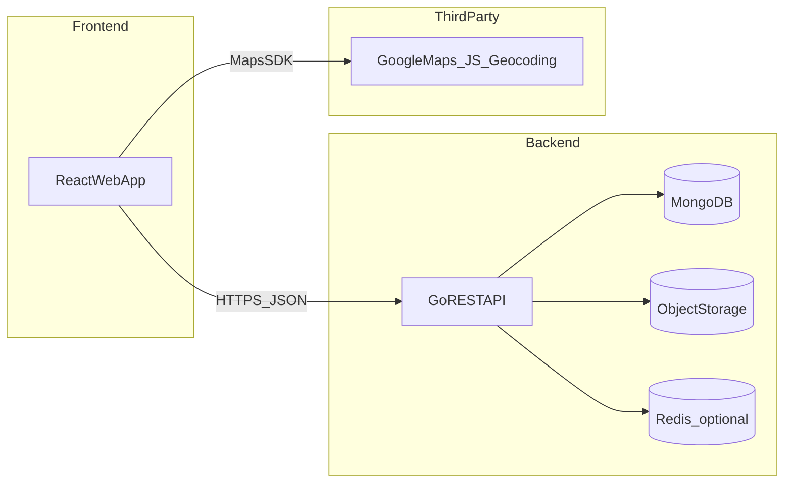
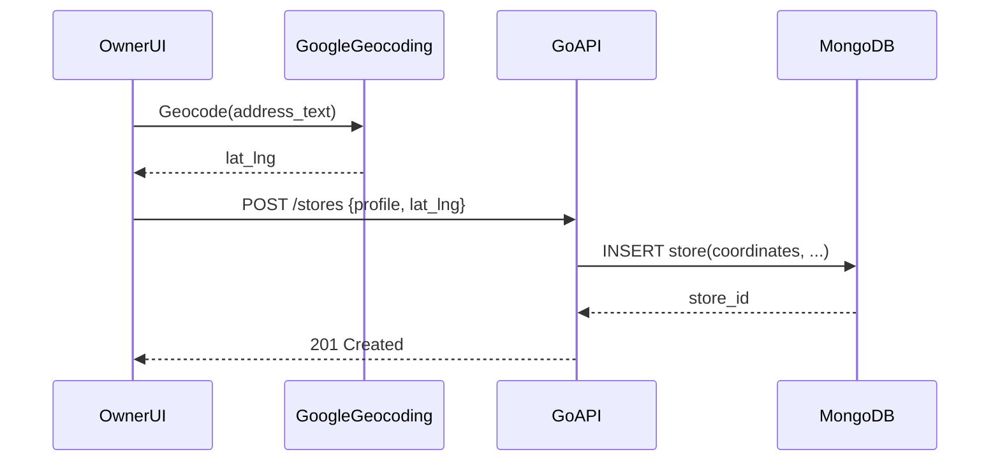
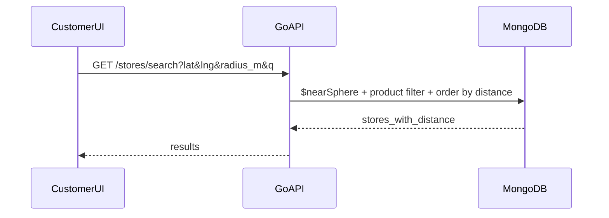

# Architecture (MVP) — Tindahan

## Goals
- **Fast “near me” item discovery**: return nearby stores with matching inventory, ordered by distance.
- **Simple owner workflows**: create store, pin location, update inventory quickly, manage requests.
- **Maintainable backend**: clear layering so the system can grow to ordering/delivery later.

## Non-goals (MVP)
- Microservices, event buses, distributed transactions
- Complex recommendation engines
- Full real-time chat

## System overview

## Key architectural decisions
- **Single web app, role-based routes (RBAC)**: one React codebase with “Customer” and “StoreOwner” experiences behind role checks.
- **Go monolith API**: one deployable service for MVP; keep boundaries via internal packages (handlers/services/repos).
- **MongoDB with geospatial queries**: store locations as coordinates and query with `$nearSphere` and geospatial operators.
- **Google Maps for UI**: use Google Maps JS for map rendering; use geocoding for address → coordinates (owner store setup).
- **Inventory truth model (MVP)**: keep it simple (stock quantity + `last_updated`); optional boolean later.

## Backend structure (implemented)
Actual package layout used in implementation:
- `api/route` (routing, middleware setup)
- `api/controller` (request parsing/validation, response mapping)
- `api/middleware` (JWT auth, CORS, role checking)
- `usecase` (business logic, authorization checks)
- `repository` (MongoDB queries, transactions)
- `domain` (types/entities, DTOs, enums)
- `bootstrap` (app initialization, environment loading)
- `internal/tokenutil` (JWT token utilities)
- `mongo` (database connection management)

## Primary flows

### 1) Owner creates store and pins location
1. Owner fills store profile + address.
2. Frontend uses Google geocoding (or API does it) to convert address to coordinates.
3. API stores the location as MongoDB coordinates.

### 2) Customer searches item near me
1. Customer enters query + allows location (or uses a selected map center).
2. API searches `products` collection and filters by store proximity.
3. MongoDB `$nearSphere` filters stores within radius and orders by distance.
4. Response includes store summary + distance + availability + staleness.

### 3) Customer requests an item
1. Customer opens a store and submits an item request.
2. API creates `ItemRequest` with status `pending`.
3. Owner sees request list and updates status.
4. Customer polls (or later: server-sent events/websocket) for status updates.

## Data storage choices
- **Document database first**: MongoDB handles store profiles, inventory, requests, and reviews well with flexible schemas.
- **Geospatial in DB**: MongoDB's built-in `$nearSphere` and geospatial operators handle radius filtering/ordering efficiently.
- **Object storage**: store banner images outside the DB; keep only URLs/keys in DB.

## Caching & performance (optional for MVP)
- Cache hot searches by `(rounded_lat, rounded_lng, q, radius)` for short TTL (e.g. 30–120s).
- Cache store profile responses if inventory isn’t changing frequently.
- Use DB indexes (see `docs/DATA_MODEL.md`) to keep geospatial and search queries fast.

## Security & access control (MVP)
- **Authentication**: Google Sign-In (OIDC) is recommended for onboarding speed.
- **Authorization**:
  - customer: can create requests/reviews
  - owner: can modify only their own store/inventory/requests
  - admin (later): moderation actions
- **Rate limits**: basic request throttling for search and request creation endpoints.

## Observability (MVP baseline)
- Structured logs (request id, user id, store id where relevant)
- Metrics: request latency, DB query duration, error rate
- Basic tracing later if needed

## Deployment (MVP)
- **API**: single Go service container
- **DB**: MongoDB with geospatial indexes
- **Static web**: deploy React build to static hosting (or serve behind a CDN)
- **Secrets**: environment variables (maps keys, DB URL, storage credentials)

## Trade-offs & alternatives
- **Google Maps vs OSM**: Google yields faster UX but costs can grow; OSM is cheaper but more DIY geocoding/search.
- **Monolith vs microservices**: monolith is faster to build and iterate; boundaries in code keep future split possible.
- **Boolean stock vs quantity**: boolean is simpler and more reliable early; quantities add value but increase maintenance burden.

