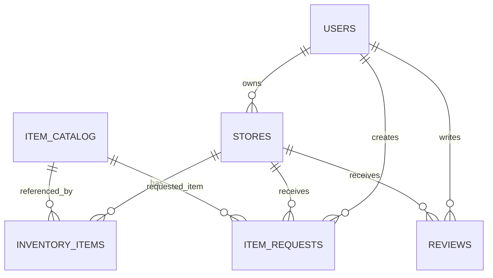

# Data model (MVP) — Tindahan

## Overview
The MVP data model supports:
- Store discovery by distance (PostGIS)
- Inventory availability per store
- Item requests (customer → owner)
- Reviews (customer → store)

## Conventions
- All IDs are UUIDs.
- `created_at`, `updated_at` timestamps on primary tables.
- Soft delete only where needed (optional for MVP).

## Entity relationship map

## Tables (logical)

### `users`
- `id`
- `role` (enum: `customer`, `owner`, `admin`)
- `display_name`
- `email` (unique if present)
- `photo_url` (optional)

Auth identities can be kept separate:

### `auth_identities` (recommended)
- `id`
- `user_id` (FK → `users.id`)
- `provider` (e.g. `google`)
- `provider_subject` (unique per provider)
- `created_at`

### `stores`
- `id`
- `owner_user_id` (FK → `users.id`)
- `name`
- `description` (optional)
- `banner_image_key` or `banner_url` (optional)
- `address_text` (optional)
- `geo_point` (PostGIS geography point)
- `hours_json` (optional, later)
- `contact_json` (optional)
- `is_active` (default true)

### `item_catalog`
Canonical items to reduce duplicates and improve search quality.
- `id`
- `name` (e.g. `Pancit Canton`)
- `normalized_name` (e.g. lowercased, stripped)
- `category` (optional)
- `unit` (optional)

### `inventory_items`
Inventory at a given store for a catalog item.
- `id`
- `store_id` (FK → `stores.id`)
- `catalog_item_id` (FK → `item_catalog.id`)
- `in_stock` (boolean)
- `price` (numeric, optional)
- `quantity` (optional; not required for MVP)
- `last_updated_at` (timestamp; update when stock/price changes)

### `item_requests`
Customer demand signal and owner response.
- `id`
- `customer_user_id` (FK → `users.id`)
- `store_id` (FK → `stores.id`)
- `catalog_item_id` (FK → `item_catalog.id`, nullable if free-text)
- `free_text_item_name` (nullable)
- `qty` (optional)
- `notes` (optional)
- `status` (enum: `pending`, `accepted`, `declined`, `fulfilled`, `cancelled`)
- `owner_response_notes` (optional)

### `reviews`
- `id`
- `store_id` (FK → `stores.id`)
- `customer_user_id` (FK → `users.id`)
- `rating` (int 1..5)
- `text` (optional)

## PostGIS details

### Store location type
Use a **geography** type for distance in meters:
- `geo_point geography(Point, 4326)`

To set a point from lat/lng:
- `ST_SetSRID(ST_MakePoint(lng, lat), 4326)::geography`

### Nearest store search (concept)
Filter by radius and order by distance:
- `ST_DWithin(stores.geo_point, :center, :radius_m)`
- `ST_Distance(stores.geo_point, :center)` for ordering

## Indexes (important for MVP performance)

### Geospatial index
- **GIST on `stores.geo_point`**

### Inventory lookup
- Unique constraint (or unique index) on `(store_id, catalog_item_id)`
- Index on `inventory_items(catalog_item_id, in_stock)`
- Index on `inventory_items(store_id)`

### Item search
Start simple:
- Index on `item_catalog(normalized_name)`

If you need better search:
- Trigram index on `item_catalog.normalized_name` (Postgres `pg_trgm`)
- Or `tsvector` full-text search field

### Reviews
- Index on `reviews(store_id)`
- Unique constraint on `(store_id, customer_user_id)` (one review per customer per store)

### Requests
- Index on `item_requests(store_id, status, created_at)`
- Index on `item_requests(customer_user_id, created_at)`

## Data integrity rules (MVP)
- Owner can only modify stores where `stores.owner_user_id == current_user.id`.
- Owner can only modify inventory for their store.
- Owner can only update request statuses for their store.
- Customer can only create/cancel their own requests and create/update their own reviews.

## Staleness and trust cues
Inventory availability should always include:
- `inventory_items.last_updated_at`
Frontend can display:
- “Updated X minutes/hours/days ago”
Optional future rule:
- auto-demote results where last updated is older than N days

